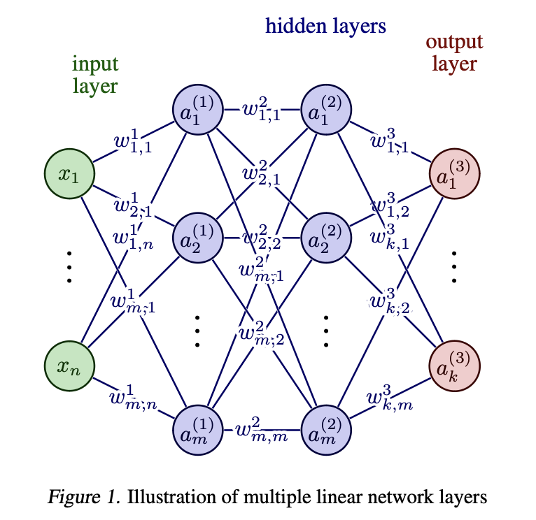
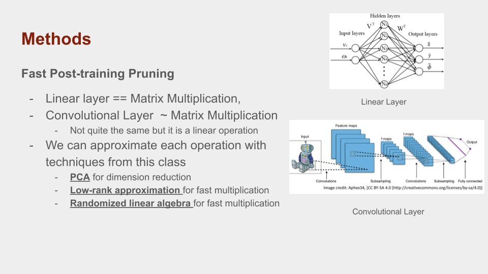
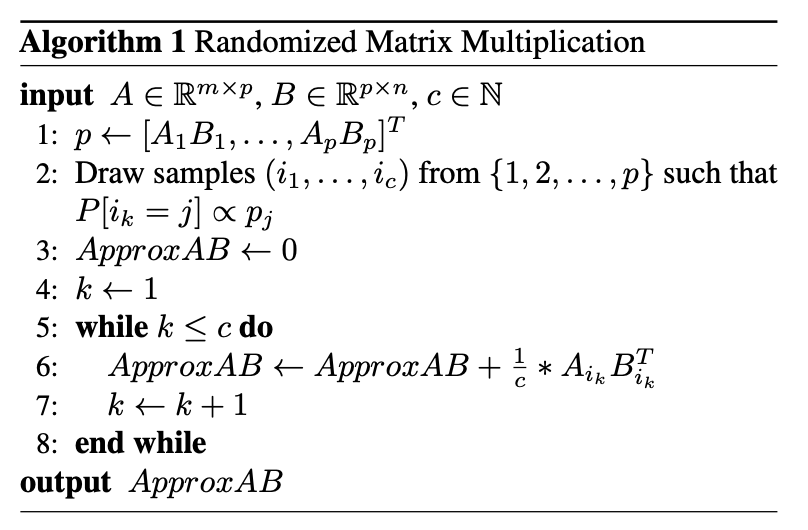
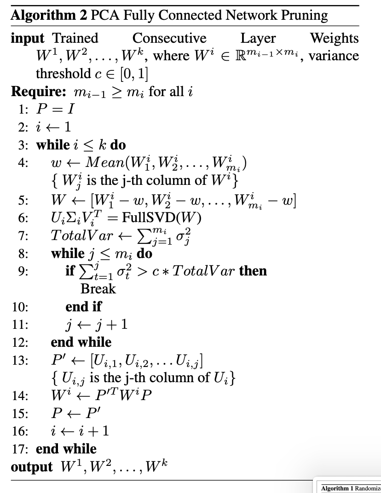
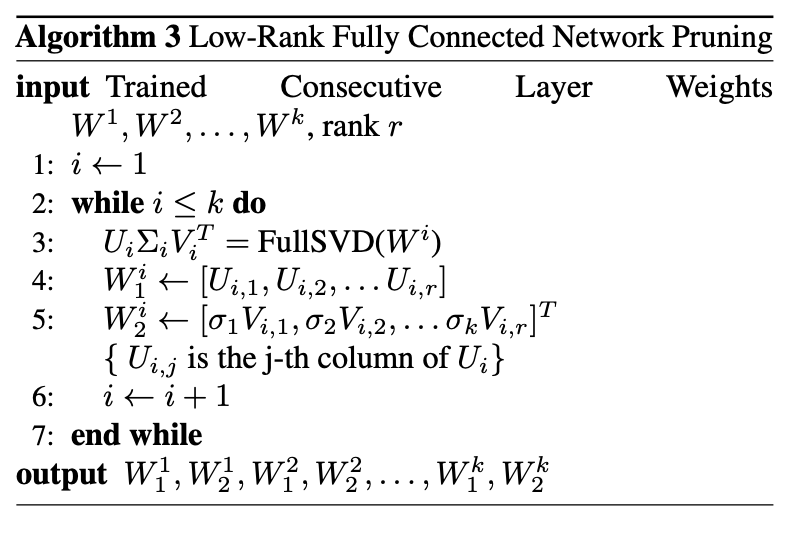

# neural_network_pruning
# Pruning Neural Networks with Matrix Methods (Final Project for 18.065 Spring 2024)

### By Benjamin Ebanks & Yajvan Ravan

Neural Networks are the state-of-the-art models for tasks such as classification, regression, generative modeling, etc, yet most networks are very large (AlexNet (240Mb, 21 M parameters), ChatGPT (500Gb, 175 B parameters), etc.).

This leads to high inference time, necessitated lots of computational power, and limits applications in edge computing. Pruning aims to reduce redundant parameters, and we approach this using simple linear algebra techniques.

This project was done for 18.065 (Matrix Methods) & the code can be found [here](https://github.com/yravan/neural_network_pruning).

---

## Methods

    
    

        Methods
    

## Algorithm Pseudocode

    
    
    
    

        Algorithm Pseudocode
    

---

## Experiment Results

Our experiments indicated that:

- **Randomized multiplication** does not seem to improve the performance of our fully connected networks. The overhead of drawing samples and the number of samples needed to achieve good performance causes the inference time of the randomized network to be significantly larger than the unmodified network.
- **PCA pruning** is quite effective for substantially improving model performance without a substantial loss in accuracy. The theoretical effectiveness is best realized for larger networks where multiplication is a bottleneck.
- **Low-rank approximation pruning** is quite effective for substantially improving model performance without a substantial loss in accuracy. The theoretical effectiveness is best realized for larger networks where multiplication is a bottleneck.
- **These methods are not particularly useful for CNNs**, due to computational overhead and practical differences in computing power.

More in-depth analysis and results can be found below.

---

## Project Presentation

[View Project Presentation](assets/Presentation-2.pdf)

---

## Project Report

[View Project Report](assets/icml2024-2.pdf)

